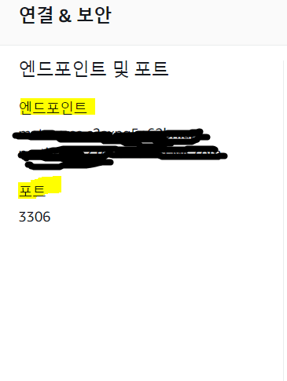
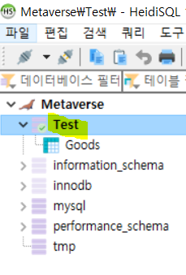
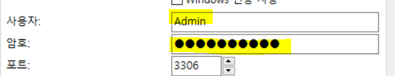

## SpringBoot + AWS RDS + JPA + (Unity) <small>▶메타버스 관리자 페이지 만들기 🥽</small>


### 🔑 SpringBoot + AWS RDS 연동하는 방법 (Gradle 기준)

<b>1. build.gradle 에 dependencies 추가</b>
``` xml
// DB 연동
implementation 'org.springframework.boot:spring-boot-starter-data-jpa'
implementation group: 'org.mariadb.jdbc', name: 'mariadb-java-client', version: '2.4.0'
implementation group: 'com.zaxxer', name: 'HikariCP', version: '3.3.0'
```
<br/>
<br/>
<b>2. application.yml 작성</b>

- 기존 application.properties 파일을 지우고 새로 파일을 작성한다.
``` xml
server:
  port: 8080

spring:
  data:
    maria:
      jdbc-url: jdbc:mariadb://데이터베이스_엔드포인트:포트번호/데이터베이스명?useUnicode=yes&characterEncoding=UTF-8
      driver-class-name: org.mariadb.jdbc.Driver
      username: 사용자
      password: 암호
  jpa:
    properties:
      hibernate:
        #show_sql: true
        format_sql: true
        temp:
          use_jdbc_metadata_defaults: false
    generate-ddl: true
```
<br/>
* 엔드포인트 및 포트번호 : RDS 데이터베이스 정보에 쓰여있는 그대로 복사 + 붙여넣기


<br/>
* 데이터베이스 명 : 사용할 데이터베이스 (첨부 사진은 HeidiSQL 기준)


<br/>
* username , password : 데이터베이스 세션 관리자에 있는 정보 입력 (첨부 사진은 HeidiSQL 기준)



<br/>
<br/>
<br/>
<hr>
<b>📖 Reference 🙇‍♀️</b>
https://wickies.tistory.com/101?category=768093
